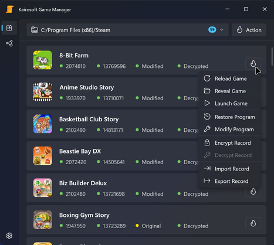
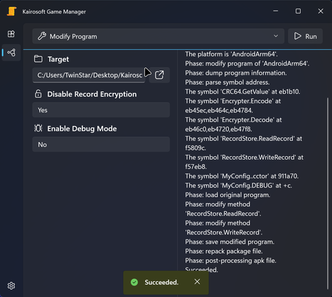
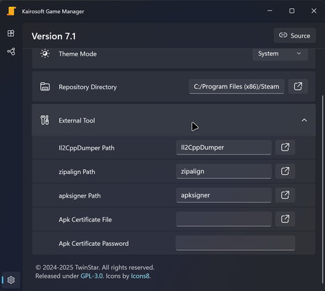

# Kairosoft Game Manager

开罗游戏管理器。

> 适用于通过 Steam 安装的 Windows 版本开罗游戏。

[更新日志](./CHANGELOG.md)

## 应用预览

## 功能列表

* 禁用游戏对存档文件的加密与验证。

	> 仅支持 `Windows` 与 `Android` 平台的开罗游戏。

* 启用游戏的调试模式（仅部分游戏有效）。
	
	> 仅支持 `Windows` 与 `Android` 平台的开罗游戏。

* 加密或解密游戏存档。
	
	> 支持任意平台的开罗游戏。

* 导出或导入游戏存档（允许跨设备、跨账号转移存档）。
	
	> 支持任意平台的开罗游戏。

## 使用方法

在 [Release](https://github.com/twinstar6980/KairosoftGameManager/releases/tag/Latest) 页中可以下载到最新版本的 `msix` 安装包文件。

> 安装前需要先信任 `msix` 中的签名证书。\
> 右键查看 `msix` 的属性，切换到 ⌈ 数字签名 ⌋ 页，选择列表中第一项，再点击 ⌈ 详细信息 ⌋ ，在弹出的窗口中依次选择 ⌈ 查看证书 ⌋ - ⌈ 安装证书 ⌋ - ⌈ 本地计算机 ⌋ - ⌈ 将所有证书都放入下列存储 ⌋ - ⌈ 受信任人 ⌋ ，完成证书的安装。

> GitHub Release 中仅保留最后一次分发，历史分发可以在我的 [OneDrive](https://1drv.ms/f/c/2d321feb9cd374ed/Eu1005zrHzIggC2GAAAAAAABZClnjoZtr_WdR-EfZLTLkA?e=JZRzDV) 中找到。

### `Manager` 管理页

该页面会检索并显示设备上安装的开罗游戏，使用户能快速对游戏程序与存档执行修改等操作。

* 顶部操作栏左侧下拉框会显示当前所检索的 `Steam` 根目录，默认为 `C:/Program Files (x86)/Steam` ；下拉选项中可以重载游戏列表或重选该目录。

* 操作栏下方的游戏列表中列出了检索到的所有开罗游戏，每个列表项表示一个游戏，显示游戏的安装路径、Steam 用户标识、图标、英文名、版本号、修改状态等信息。
	
	* 程序状态：游戏列表项信息栏的第三列，指示游戏程序文件是否被应用修改过，分为 `None` 未知、`Original` 原始未修改、`Modified` 已修改。
	
	* 存档状态：游戏列表项信息栏的第四列，指示游戏存档文件是否被应用解密过，分为 `None` 未知、`Invalid` 无效、`Original` 原始已加密、`Decrypted` 已解密。

* 点击游戏列表项右下角的 `Action` 火焰图标按钮，可以选择需要对游戏进行的操作：
	
	* `Reload Game` ：重新加载游戏，刷新列表中该游戏的状态信息。
	
	* `Reveal Game` ：在 `Windows Explorer` 中显示游戏的根目录。
	
	* `Launch Game` ：启动游戏。
	
	* `Restore Program` ：将游戏程序恢复为未修改的原始状态。
	
	* `Modify Program` ：修改游戏程序。
	
	* `Encrypt Record` ：加密游戏存档。
	
	* `Decrypt Record` ：解密游戏存档。
	
	* `Import Record` ：导入 `kgra` 存档包文件，覆盖当前游戏存档。
	
	* `Export Record` ：将游戏存档导出为单一的 `kgra` 存档包文件。

> 游戏列表支持多选模式，通过顶部操作栏右侧的 `Action` 按钮可以对所选游戏进行统一操作。

### `Function` 功能页

该页面允许用户手动运行存档加密、程序修改等功能。

* 顶部操作栏左侧下拉框会显示当前选中的功能，可以通过下拉选项进行切换；点击右侧 `Run` 按钮将运行所选功能。

* 操作栏下方左侧显示了当前功能的所需参数，右侧显示运行日志。

可以使用的功能及其参数如下：

* `Encrypt Record` ：加密/解密游戏存档；开罗游戏存档使用异或加密，对已加密文件的再次加密可视为对文件的解密。
	
	* `Target Directory` ：需要加密/解密的存档目录；对于 Steam 版开罗游戏，存档目录是游戏根目录下的 `/saves/<Steam-User-Identifier>` 。
	
	* `Key` ：密钥，一或更多个十六进制表示的字节值，每个字节以空格分隔；也可以输入 `d32:` 或 `d64:` 前缀后随十进制数表示其对应的小端序字节表示。对于 Steam 版开罗游戏，密钥是 Steam 用户标识（64位整数）的小端序字节表示。

* `Modify Program` ：修改游戏程序。
	
	* `Target` ：需要修改的游戏根目录，或者游戏安装包文件，支持 `zip` 、`apk` 、`apks` 三类安装包。
	
	* `Disable Record Encryption` ：禁用游戏存档的加密存储；禁用后，游戏在读取和保存存储文件时将不再进行加密/解密的步骤，用户存档将以明文形式直接存储在存档目录中；禁用后将不再能读取先前游戏存储的加密存档，需要对原有存档进行解密，或是删除并生成全新的空存档。
	
	* `Enable Debug Mode` ：启用游戏的调试模式，会在游戏运行时显示调试菜单等 UI ；在较新的游戏版本中，官方疑似在发行版中禁用了调试菜单相关功能的编译，启用调试模式仅能显示一些简单的调试性 UI ，不再能调出调试菜单。
	
	> 此功能会使用到一些外部工具，需要在设置页中填写好相应配置项，具体见下文对设置页的说明。
	> 
	> 若修改目标是 `apk` 或 `apks` 安装包，应用会尝试在修改完成后对其进行符合 Android 软件开发规范的安装包对齐与签名，若所需的外部工具配置项无效，应用将跳过对齐或签名；这两个步骤不是必须的，若需了解详细信息，请查阅相关的 Android 软件开发文档。

### `Function` 设置页

该页面会显示当前的应用版本信息与设置项，如下：

* `Theme Mode` ：应用的主题样式。

* `Steam Directory` ：管理页中检索游戏所使用的 `Steam` 根目录。

* `External Tool` ：应用部分功能可能调用的外部工具的配置，参见上述功能页中的说明。
	
	* [`Il2CppDumper Path`](https://github.com/Perfare/Il2CppDumper/releases) ：修改游戏程序时需要使用到的工具，若未指定到有效路径，修改将失败。
	
	* [`zipalign Path`](https://developer.android.com/tools/zipalign) ：修改 `apk` 文件后进行包对齐的工具，若未指定到有效路径，将跳过包对齐。
	
	* [`apksigner Path`](https://developer.android.com/tools/apksigner) ：修改 `apk` 文件后进行包签名的工具，若未指定到有效路径，将跳过包签名。
	
	* `Apk Certificate File` ：修改 `apk` 文件后进行包签名时使用的证书文件，若未指定到有效路径，将跳过包签名。
	
	* `Apk Certificate Password` ：修改 `apk` 文件后进行包签名时使用的证书密码，若为空，将跳过包签名。
	
	> 以上设置中，程序路径类型的设置项会先检测指定的路径是否存在，若不存在，将尝试从 `PATH` 环境变量中检索对应程序。

## 数据安全

为了获取已安装的开罗游戏与存档密钥，应用会检索本地 Steam 账号的本地库状态信息；应用不会在本地或网络上存储这些信息，项目中也不存在与联网访问相关的代码与权限。

尽管经过了一定的测试，但应用 **无法保证** 在修改游戏程序或存档时不会造成数据丢失的严重后果；应用不对丢失的数据负责，如有疑虑，请在操作之前自行备份游戏的存档文件（位于 ⌈ Steam ⌋ - ⌈ 库 ⌋ - ⌈ 游戏页 ⌋ - ⌈ 设置项 ⌋ - ⌈ 管理 ⌋ - ⌈ 浏览本地文件 ⌋ - ⌈ saves 目录 ⌋ ）。

## 开源说明

本项目可以在不违反 **GPL v3** 的基础上自由地使用与修改。

本项目不为因使用本项目代码或程序而产生的任何问题负责。
